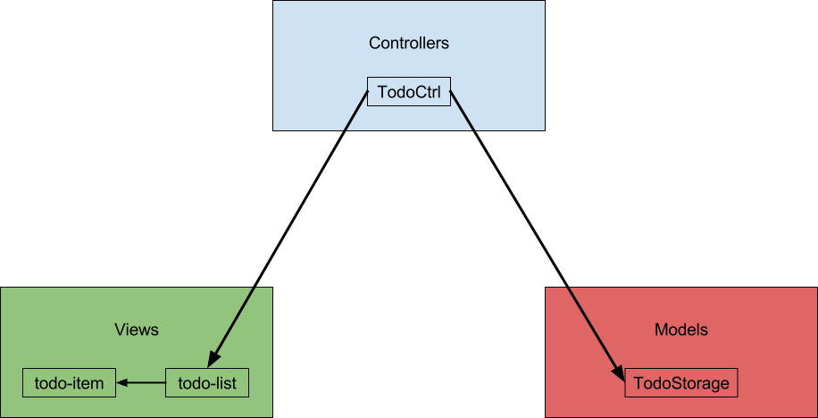
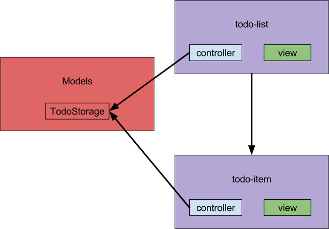

John bad oss berätta lite om att använda en mer komponentbaserad arkitektur i Angular.
Vi har valt att refaktorera Todomvc steg för steg från en mer klassisk MVC struktur till en komponentbaserad struktur och kommer här att förklara varje steg.
Att använda komponenter börjar bli väldigt populärt i JavaScript världen, t.ex. är Angular 2, React och Polymer helt komponent-baserade.

I [MVC branchen](https://github.com/Pajn/todomvc/tree/MVC) är de olika delarna uppdelade i vad de är, toppnivån består av controllers, directives, services och views. Det är en väldigt vanlig struktur i Angular och är inspirerad av serversideramverk som Rails. Ett beroendediagram över applikationen skulle se ut något såhär:


I [component-structure branchen](https://github.com/Pajn/todomvc/tree/component-structure) är filerna uppdelade i vad de gör istället för vad de är för något. Ska vi hitta kontrollern för todo-list går vi först till todo-list och sen till controller istället för tvärt om. Många tycker att den här typen av uppdelning känns mer naturlig, då det är närmare hur man tänker på olika delar i en applikation. Dessutom är saker som ofta ändras tillsammans grupperade vilket gör det enklare att hitta och veta att allt som är relaterat till ändringen har blivit ändrat.
Notera dock att servicen som hanterar datan är placerad utanför komponenten. Att domänlogiken ska vara separerad från vyn följer Single Responsability Principle från SOLID vilket är viktigt då de ändras av helt olika anledningar, om kunden t.ex. ber oss ändra ordningen på två fällt i ett faktureringsystem ska inte totalsumman på fakturan ändras samtidigt.
Det gör att det nya beroendediagramet ser som nedan. Vi har fortfarande samma beroende mellan de olika klasserna, men den logiska grupperingen av klasserna är ändrad.


I [directives branchen](https://github.com/Pajn/todomvc/tree/directives) så behåller vi samma struktur som ovan, men använder inte längre Angulars `ng-controller` och `ng-template` utan varje komponent är ett eget direktiv, vilket ger flera fördelar. Den som använder vår komponent skriver nu
```xml
<todo-item todo="todo" store="ctrl.store" />
```
istället för
```xml
<div	ng-controller="TodoCtrl"
ng-include="'/app/components/todo-item/view.html'">
</div>
```
vilket dels är lättare att skriva och kräver mindre insyn i hur komponenten fungerar, om komponenten har en vy och/eller kontroller är upp till komponenten, inte användaren av den. 
Dessutom är vi explicita med vad som skickas in i komponenten genom attributen `todo` och `store` istället för att komponenten själv hämtar de sakerna via Angulars scope. Det gör det möjligt att se vad komponenten faktiskt använder, och vi har inga dolda beroenden på variabelnamn mellan komponenterna.

I och med Angular 1.5 finns stöd för `.component` vilket gör samma sak som vi gjorde i directives branchen ovan, men med lite mindre konfiguration. Exempel på hur det ser ut finns i [components branchen](https://github.com/Pajn/todomvc/tree/components).

Slutligen så har vi en [branch](https://github.com/Pajn/todomvc/tree/es2015) som använder es2015 där varje komponent är en klass istället för en factory-funktion, detta gör att koden blir ganska lik [Angular 2](http://learnangular2.com/components/). Vilket gör det enklare att migrera i framtiden.
